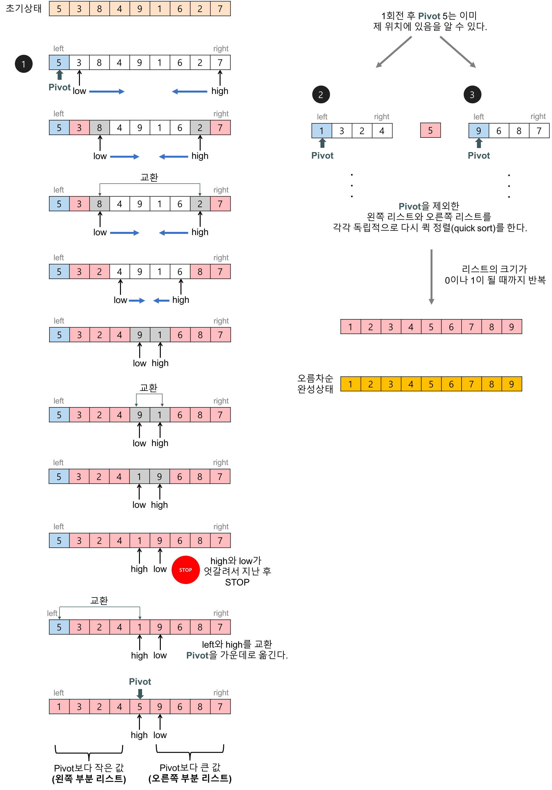

# 자료구조와 알고리즘 개인 공부

자바스크립트로 소스코드를 구성하여 공부함.

## 1. 정렬

퀵 정렬(quick_sort) > 삽입 정렬(insert_sort) > 선택 정렬(selection_sort) > 버블 정렬(bubble_sort)

### 1.1 퀵정렬

배열에 5, 3, 8, 4, 9, 1, 6, 2, 7이 저장되어 있다고 가정하고 자료를 오름차순으로 정렬해 보자.

