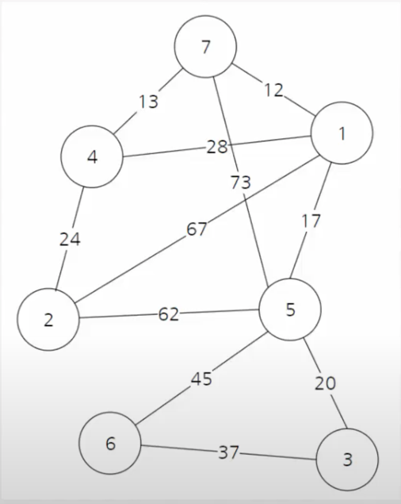
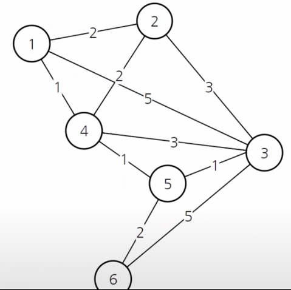
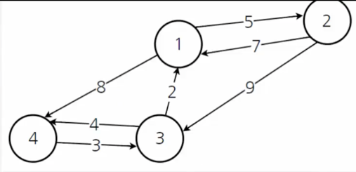
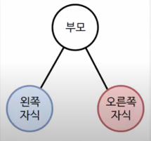
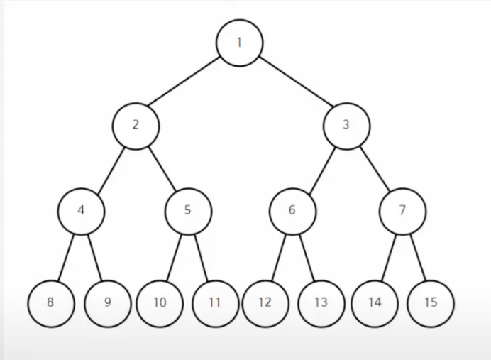

# 자료구조와 알고리즘 개인 공부

코딩 면접관련 **자료구조와 알고리즘**을 자바스크립트 소스코드 예제로 작성하구성하여 공부함.

[동빈나님의 유트브 영상](https://www.youtube.com/watch?v=qQ5iLNjpxSk&list=PLRx0vPvlEmdDHxCvAQS1_6XV4deOwfVrz&index=2) (실전 알고리즘 강좌)
를 참조하여 학습하였습니다.

## 1. 정렬

계수 정렬(범위 조건이 있다면) >
힙 정렬(heap_sort) = 병합 정렬(merge_sort) >= 퀵 정렬(quick_sort) >
삽입 정렬(insert_sort) > 선택 정렬(selection_sort) > 버블 정렬(bubble_sort)

### 1.1 계수 정렬

- 범위가 존재한다면 가장 빠름 ex) 5 이하의 숫자들로 만들어진 array
- 시간복잡도: O(N)

### 1.2 힙 정렬

- 이진트리 사용
- 시간복잡도: O(N * logN)
- '하나의 노드'에 대해 힙 생성 알고리즘을 수행하여 힙구조 형성함.

### 1.3 병합 정렬

- 모두 분해하여 다시 병합한다.
- 시간복잡도: O(N * logN)
- 퀵정렬도 빠르지만, 만약에 정렬되있는 array의 경우 정렬하는 것이 느림(편향적인 정렬, O(N * N))
  병합정렬은 이러한 평향적인 부분이 없어 N * logN을 보장함.

### 1.4 퀵정렬

- 배열에 5, 3, 8, 4, 9, 1, 6, 2, 7이 저장되어 있다고 가정하고 자료를 오름차순으로 정렬해 보자.
- 시간복잡도: O(N * logN)
- 자바스크립트의 sort 함수가 퀵정렬로 되어있음.

## 2. 그래프

정점(vertex)과 간선(edge)으로 이루어진 그래프에 대한 알고리즘

### 2.1 너비 우선 검색(BFS)

- 시간복잡도: O(V+E), V: 정점의 갯수 / E: 간선의 갯수
- 내용: 시작 점이 주어졌을 때, 최단 경로를 찾아줌
- 사용: 맹목적인 탐색, 최단 경로를 찾아줌 => 최단 길이 보장해야 될 시 사용
- 필요 사항: 큐(queue)

### 2.2 깊이 우선 검색(DFS)

- 시간복잡도: O(V+E), V: 정점의 갯수 / E: 간선의 갯수
- 사용: 맹목적인 탐색
- 필요 사항: 스택(stack), 스택을 사용하지 않고 재귀를 사용해도됨.

## 3. 알고리즘

### 3.1 합집합 찾기

- 내용: 재귀를 사용하여 부모노드를 찾음

### 3.2 크루스칼 알고리즘

- 목적: 가장 적은 비용으로 모든 노드를 연결하기 위함.
- 사용 예시: 여러 개의 도시가 있을 때 가 도시를 도로를 이용해 연결하고자 할 때(가장 적은 비용)
- 용어 정리:
  노드 = 정점 = 도시: 그래프의 점  
  간선 = 거리 = 비용: 그래프의 선
- 최소비용 계산:
  간선 갯수 = 노드 갯수 - 1

### 3.3 다익스트라 알고리즘

- 목적: 다이나믹 프로그래밍을 활요한 최단경로 탐색
- 특징: 최단거리를 구할 때 그 이전까지 구했던 최단거리 정보를 사용

- 작동 과정:
    1. 출발노드 설정
    2. 출발노드 기준으로 각 노드 최소비용 저장
    3. 방문하지 않은 노드 중 가장 비용이 적은 노드 선택
    4. 해당 노드를 거쳐 특정한 노드로 가는경우를 고려하여 최소비용 갱신
    5. 3,4번을 반복함

### 3.4 플로이드 와샬

플로이드 와샬 알고리즘

- 목적: 모든정점에서 모든 정점으로의 최단경로 구할 때
- 특징: 거쳐가는 정점을 기준으로 최단경로를 구함.

## 4. 이진트리

이진트리에서 데이터를 탐색하는 방법은 세가지.

### 4.1 전위 순회(Preorder Traversal)

순서: 1-2-4-8-9-5-10-11-3-6-12-13-7-14-15

1. 자기 자신 처리
2. 왼쪽 자식 처리
3. 오른쪽 자식 처리

### 4.2 중위 순회(Inorder Traversal)

순서: 8-4-9-2-10-5-11-1-12-6-13-3-14-7-15

1. 왼쪽 자식 처리
2. 자기 자신 처리
3. 오른쪽 자식 처리

### 4.3 후위 순회(Postorder Traversal)

※ 수식에 대해 컴퓨터(계산기)가 처리하는 방식

순서: 8-9-4-10-11-5-2-12-13-6-14-15-7-3-1

1. 왼쪽 자식 처리
2. 오른쪽 자식 처리
3. 자기 자신 처리

