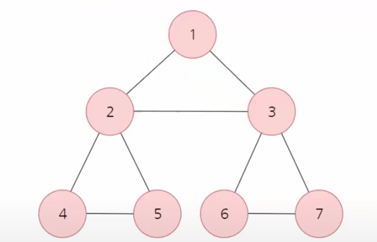

# 자료구조와 알고리즘 개인 공부

자바스크립트로 소스코드를 구성하여 공부함.

## 1. 정렬

계수 정렬(범위 조건이 있다면) >
힙 정렬(heap_sort) = 병합 정렬(merge_sort) >= 퀵 정렬(quick_sort) >
삽입 정렬(insert_sort) > 선택 정렬(selection_sort) > 버블 정렬(bubble_sort)

### 1.1 계수 정렬

- 범위가 존재한다면 가장 빠름 ex) 5 이하의 숫자들로 만들어진 array
- 시간복잡도: O(N)

### 1.2 힙 정렬

- 이진트리 사용
- 시간복잡도: O(N * logN)
- '하나의 노드'에 대해 힙 생성 알고리즘을 수행하여 힙구조 형성함.

### 1.3 병합 정렬

- 모두 분해하여 다시 병합한다.
- 시간복잡도: O(N * logN)
- 퀵정렬도 빠르지만, 만약에 정렬되있는 array의 경우 정렬하는 것이 느림(편향적인 정렬, O(N * N))
  병합정렬은 이러한 평향적인 부분이 없어 N * logN을 보장함.

### 1.4 퀵정렬

- 배열에 5, 3, 8, 4, 9, 1, 6, 2, 7이 저장되어 있다고 가정하고 자료를 오름차순으로 정렬해 보자.
- 시간복잡도: O(N * logN)
- 자바스크립트의 sort 함수가 퀵정렬로 되어있음.

## 2. 그래프

정점(vertex)과 간선(edge)으로 이루어진 그래프에 대한 알고리즘

### 2.1 너비 우선 검색(BFS)

- 시간복잡도: O(V+E), V: 정점의 갯수 / E: 간선의 갯수
- 내용: 시작 점이 주어졌을 때, 최단 경로를 찾아줌
- 사용: 맹목적인 탐색, 최단 경로를 찾아줌 => 최단 길이 보장해야 될 시 사용
- 필요 사항: 큐(queue)

### 2.2 깊이 우선 검색(DFS)

- 시간복잡도: O(V+E), V: 정점의 갯수 / E: 간선의 갯수
- 사용: 맹목적인 탐색
- 필요 사항: 스택(stack), 스택을 사용하지 않고 재귀를 사용해도됨.